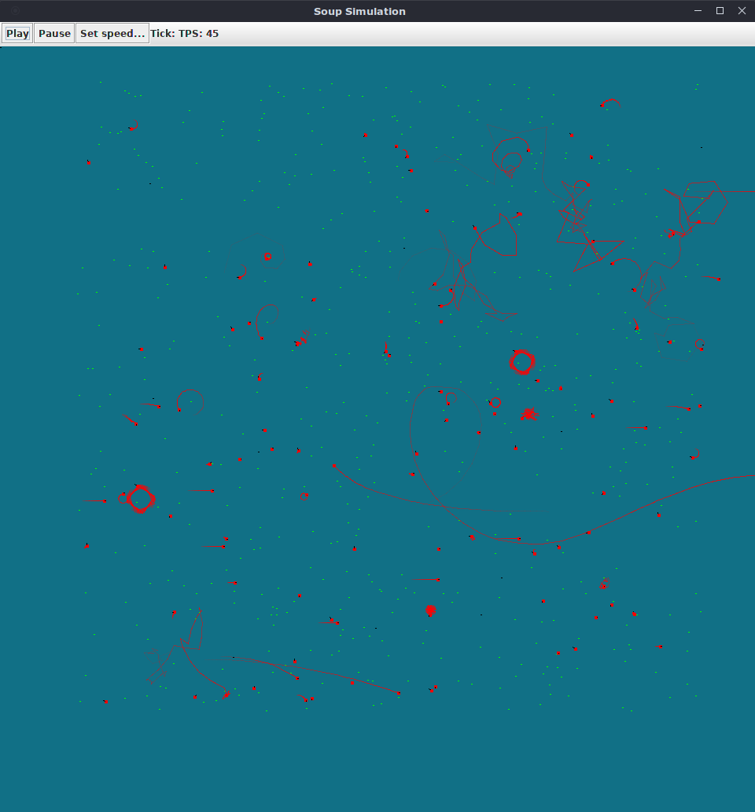

# Primordial soup simulator

This is just my naive attempt at making neural network and genetic algorithms on my own, without having read much about the topic.
The objective was to find problems to learn from experience. 

It basically generates a genetically random initial population and puts them in the world with randomly placed food.
Every time a creature eats one PlantParticle, another piece of food spawns randomly.
The creature that has the highest fitness mates with the other 19 best creatures to generate the next generation offspring.
Next's offspring gene pool is based on the best survivors of any generation, not just the latest.
There is also some radiation to induce random mutation to the offspring.

After each generation, a prev.genepool file is stored so that the simulation can be killed and automatically resumes from that generation.
If you wish to start clean, just remove the file.

The Brain does not work like a neural network ATM. I decided to make the experiment to create brains out of random java code, and it works to just get started.
The idea is to implement a proper neural network at some point in this exercise ^.^"...

If you run the simulation (with the current settings - plenty of food) you should be able to observe how the creatures tend to evolve towards just moving in circles,
faster and faster the more hungry they are. They don't want to learn to sniff because there is no need to or the pieces to build their brains does not allow that...

If you want to run a faster simulation you can try to change the setting in `SimulationRenderingSystem` to render every 5, 10 or 20 ticks. If you want a smooth representation (but slower sim) you can stop the simulation and change this code to draw every tick.

# Overview of the code

Keep in mind It's still a little bit disorganised, you can find classes that do not follow the single responsibility principle ^.^"...

The main class is PrimordialSoupSimulator. The simulation consists of different Systems that are run one after another for each simulation.

## Systems

There are (for now) the following systems:
    
    - WorldSystem: Should run updates on the world state (Currently not enabled yet)
    - VegetationSystem: Runs updates on the food for the creatures
    - CreatureSystem: Runs updates on the creatures
    - SimulationRenderingSystem: Renders the simulation every few ticks
    
## Entities/Model

    - Creature: Has Dna, a Brain, inputs, outputs, dies, counts how many plants has eaten...
    - PlantParticle: Is an inert plant that can be eaten by a Creature

## How to change simulation parameters

There is currently no UI to set up simulation parameters, so until we make one, here is a list of parameters you can tweak:

    - CreatureSystem
        - INITIAL_POPULATION: How many creatures to spawn at each iteration
        - INITIAL_GENES: Number of genes of the initial population
        - RADIATION: Chance of a given gene to mutate (defaults to 0.1f)
    - VegetationSystem
        - INITIAL_FOOD: How many food particles are there in the map at any given time
    - World
        - GRID_SIZE: Non-functional setting to tune performance of the food-seeking algorithms. The world stores PlantParticles into a hashmap of grid sections for faster iteration by zones.
    - SimulationRenderingSystem
        - DRAW_EVERY_X_TICKS: Non-functional setting to tell how often we should render the simulation. You can tweak this to have faster simulations in expense to less smooth animation.
        